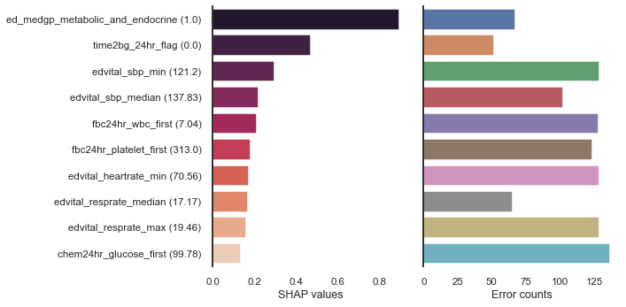
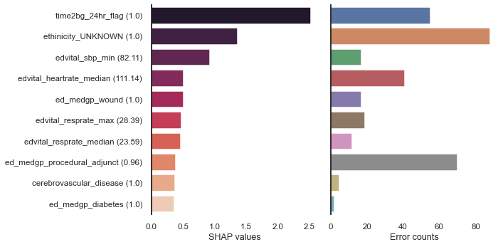

# Medical ML Model Failure Explainer

## Intro

Failure Explainer is a software tool designed specifically to look for and explain medical ML model prediction errors.

## Software dependencies

- SHAP
- Numpy
- Pandas
- Matplotlib
- Seaborn 

## Quick start

### Step 1

Start by applying your usual ML modeling pipeline:
1. Split data into train/test dataset
2. Build model on train dataset
3. Apply SHAP on model

### Step 2

Apply Failure Explainer as per code snippet below. `model` refer to trained ML model. `X_test` and `y_test` refer to held out test dataset. `shap_values` refer to SHAP values returned from application of SHAP to `model`. 

```
import Failure.Explainer

failure_explainer = Failure.Explainer(model, X_test, y_test, shap_values)
failure_explainer.find_failures()
failure_explainer.explain_false_negative(return_values=False)
failure_explainer.explain_false_positive(return_values=False)

```

`return_values` can be set to `True` to return explainer values: features, mean feature values, mean SHAP values, error counts.

### Step 3

Explainer can plot graphs to visualise errors. 


```
failure_explainer.plot_false_negative_summary()
```



```
failure_explainer.plot_false_positive_summary()
```



## Example application with MIMIC IV sepsis data in Jupyter Notebook

Open `Index.ipynb` after inputing the following command in terminal.

```
jupyter notebook
```

## References
[1] Lundberg, S. M., & Lee, S. I. (2017). A unified approach to interpreting model predictions. Advances in neural information processing systems, 30.
[2] Goldberger, A. L., Amaral, L. A., Glass, L., Hausdorff, J. M., Ivanov, P. C., Mark, R. G., ... & Stanley, H. E. (2000). PhysioBank, PhysioToolkit, and PhysioNet: components of a new research resource for complex physiologic signals. circulation, 101(23), e215-e220.

